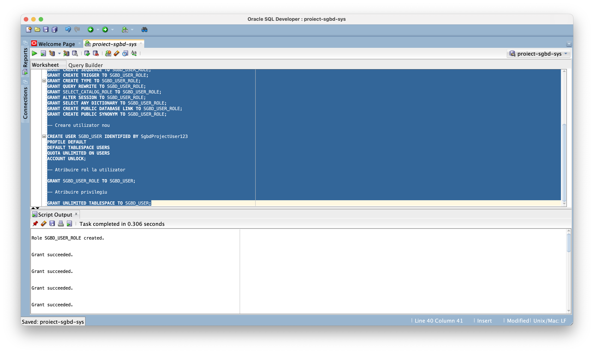

# Setup

Pentru a inițializa mediul de lucru, vom folosi `docker-compose.yml` pentru a porni un container de docker în care rulează o instanță de Oracle Database 19c Enterprise Edition, bazată pe [această imagine](https://hub.docker.com/layers/emhui/oracle/19.3.0-ee-slim-faststart/images/sha256-2b9e8eedc21286599bb1765771d647a5e9c7ba68fd5808ece9669f9ac437ad66). Întrucât toată dezvoltarea s-a realizat pe un Macbook M2 Pro, această imagine nu a funcționat, deci am construit imaginea pentru ARM urmând [acest ghid](https://gist.github.com/miccheng/8120d2e17818ba2a2d227554b70cd34e). În funcție de sistemul pe care este rulat proiectul trebuie aleasă imaginea folosită.

Utilizând comanda `docker compose -f docker-compose.yml up` putem porni containerul si ne putem conecta la baza de date din SQL Developer:

De asemenea, trebuie menționat ca vom folosi în continuare Oracle SQL Developer 23.1.1.345

# Inițializare

Vom începe prin a defini un nou utilizator, conform [ghidului de instalare și configurare](https://drive.google.com/drive/folders/1o2zgjXiz2eb0u-BayL3Awetv-yMUJGWv). Query-ul `init.sql` crează un rol nou, un utilizator nou și acordă utilizatorului toate drepturile necesare realizării cerințelor proiectului.

Toate query-urile rulate în continuare vor fi rulate de pe acest utilizator.

